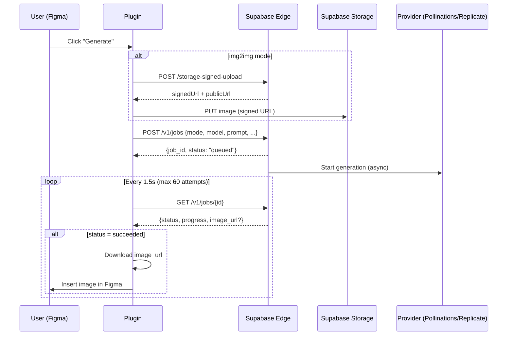

# 🎨 Photoglow Admin — Generator Plugin

Plugin Figma pour générer des images avec FLUX, Runway Gen-4 et Gen-4 Turbo via l'API Jobs de Photoglow.

## 📋 Aperçu

Ce plugin utilise une architecture de jobs avec polling pour générer des images :

```
Figma Plugin → POST /v1/jobs → Polling GET /v1/jobs/{id} → Image Supabase Storage
```

## 🚀 Installation

### 1. Configuration du Plugin

1. Ouvrir Figma → **Plugins** → **Development** → **New Plugin**
2. Choisir **"Link existing plugin manifest"**
3. Sélectionner le dossier `/figma-plugin-admin`

### 2. Configuration du Backend

Dans `/figma-plugin-admin/code.js`, remplacer :

```javascript
const PROJECT_ID = 'YOUR_PROJECT_ID'; // ⚠️ À REMPLACER !
```

Par votre vrai Project ID Supabase (trouvable dans `Settings > Project Settings > General`).

### 3. Vérifier les Endpoints

Le plugin utilise ces endpoints :

- ✅ `POST /make-server-ab844084/v1/jobs` - Créer un job
- ✅ `GET /make-server-ab844084/v1/jobs/{id}` - Vérifier le statut
- ✅ `POST /make-server-ab844084/storage-signed-upload` - Upload images

Tous ces endpoints sont déjà implémentés dans `/supabase/functions/server/index.tsx`.

## 🎯 Utilisation

### Text2Img avec FLUX

1. Sélectionner **"FLUX 1.1 Pro"**
2. Mode : **"text2img"**
3. Entrer un prompt : `professional headshot, studio lighting, 85mm look`
4. Choisir un ratio (1:1, 3:4, etc.)
5. (Optionnel) Définir un seed pour reproductibilité
6. Cliquer sur **🚀 Generate**

### Img2Img avec Gen-4

1. Sélectionner **"Runway Gen-4"**
2. Mode : **"img2img"**
3. Upload une **référence image**
4. Entrer un prompt : `linkedin headshot, clean background, confident smile`
5. Ajuster **Prompt Strength** (0.6-0.7 recommandé)
6. Cliquer sur **🚀 Generate**

### Gen-4 Turbo (rapide)

Identique à Gen-4 mais plus rapide. Parfait pour itérations rapides.

## 📊 Flow de Génération



## 🔧 Configuration CORS

Le backend Supabase Edge est configuré pour accepter `Origin: null` (requis pour Figma) :

```typescript
app.use("/*", cors({
  origin: "*", // Permet "null" de Figma
  allowHeaders: ["Content-Type", "Authorization"],
  allowMethods: ["GET", "POST", "PUT", "DELETE", "OPTIONS"],
}));
```

## 📁 Buckets Supabase

### `uploads/` (public)

- **Usage:** Images d'entrée pour img2img
- **Structure:** `{timestamp}-{filename}`
- **Accès:** Public

### `photos/outputs/` (public)

- **Usage:** Images générées finales
- **Structure:** `outputs/{YYYY-MM-DD}/{job_id}.jpg`
- **Accès:** Public

## 🎨 Modèles Disponibles

| Modèle | Provider | Mode | Vitesse | Qualité |
|--------|----------|------|---------|---------|
| **FLUX 1.1 Pro** | Pollinations | text2img | ⚡⚡⚡ Très rapide | ⭐⭐⭐ Excellent |
| **Gen-4** | Replicate | text2img + img2img | ⚡⚡ Moyen | ⭐⭐⭐⭐ Premium |
| **Gen-4 Turbo** | Replicate | text2img + img2img | ⚡⚡⚡ Rapide | ⭐⭐⭐ Très bon |

## 🛠️ Dépannage

### ❌ CORS Error

**Symptôme:** `Access to fetch blocked by CORS policy`

**Solution:**
1. Vérifier que le backend autorise `Origin: null`
2. Relancer le serveur Supabase Edge

### ❌ 422 Invalid Model

**Symptôme:** `Invalid model. Must be one of: flux, gen4, gen4-turbo`

**Solution:**
1. Vérifier l'orthographe du modèle dans le payload
2. Modèles valides : `flux`, `gen4`, `gen4-turbo`

### ❌ Upload Failed

**Symptôme:** `Upload failed: 500`

**Solution:**
1. Vérifier que le bucket `uploads` existe
2. Bucket doit être **public**
3. Vérifier la taille du fichier (< 50MB)

### ❌ Job Timeout

**Symptôme:** `Timeout: job did not complete in time`

**Solutions:**
1. Augmenter `maxTries` dans `code.js` (ligne 170)
2. Vérifier que le job n'est pas bloqué côté backend
3. Consulter les logs Supabase Edge

### ❌ Image Not Inserted

**Symptôme:** Job succeeded mais image pas dans Figma

**Solution:**
1. Vérifier que `image_url` est bien une URL Supabase (pas provider)
2. Vérifier que le bucket est accessible publiquement
3. Tester l'URL dans un navigateur

## 📝 Logs

Le plugin affiche des logs détaillés dans la console :

```
[10:30:15] ⏩ Building job request...
[10:30:15] 🧾 Job request: {...}
[10:30:16] ✅ Job created: job_1730123456_abc123
[10:30:16] ⏳ Polling for completion...
[10:30:18] 📡 Status: running (attempt 1/60)
[10:30:20] 📡 Status: running (attempt 2/60)
...
[10:30:45] 🎉 Image ready: https://...
[10:30:46] 📥 Downloading image...
[10:30:47] ✨ Image inserted into Figma!
```

## 🧪 Tests

### Test 1: FLUX text2img

```bash
# Dans le plugin Figma
Model: FLUX 1.1 Pro
Mode: text2img
Prompt: professional headshot, studio lighting
Ratio: 1:1
Seed: 777
```

**Attendu:** Image générée en ~10-15s

### Test 2: Gen-4 img2img

```bash
# Dans le plugin Figma
Model: Runway Gen-4
Mode: img2img
Reference: [Upload portrait]
Prompt: linkedin photo, clean background, confident smile
Prompt Strength: 0.65
Ratio: 3:4
```

**Attendu:** Image générée en ~30-45s

## 📚 Ressources

- [Documentation Jobs API](../ENDPOINTS_AND_BUCKETS.md)
- [Guide Supabase Storage](https://supabase.com/docs/guides/storage)
- [Figma Plugin API](https://www.figma.com/plugin-docs/)

## 🎯 Prochaines Étapes

1. ✅ Plugin installé et configuré
2. ✅ Backend déployé sur Supabase
3. ✅ Buckets créés (uploads + photos)
4. ✅ Test FLUX text2img
5. ✅ Test Gen-4 img2img
6. 🎉 Prêt pour production !

---

**Version:** 1.0  
**Date:** 6 novembre 2024  
**Auteur:** Photoglow Team
